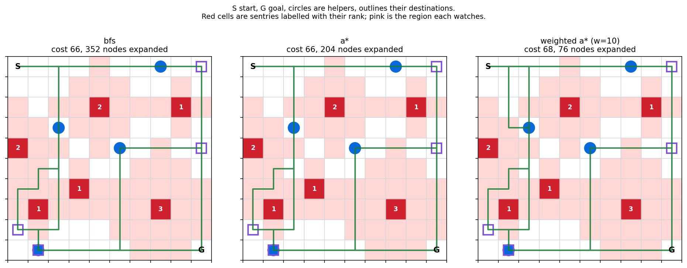

# Grid Search Algorithms

A pathfinding problem solved four ways, to compare what each search strategy
costs. A traveller must collect several helpers scattered across a grid, escort
each to its own destination, and then reach the goal, while crossing territory
watched by sentries.



The same scenario solved three ways. BFS and A* both find a 66-move route, but
A* reaches it after 204 node expansions against 352. Weighted A* expands only 76
and pays for it with two extra moves.

## The problem

Each sentry sits on a cell and watches every cell within its rank in Manhattan
distance. Its own cell cannot be entered at all, and its watched region can be
crossed for at most `rank` consecutive steps before the crossing must break off.

That rule is what makes this more than grid pathfinding. Whether a cell can be
left depends on how it was reached, so the search state is not a position but a
position together with the sentry currently watching and how many steps remain
inside its region.

Helpers are collected greedily: each leg heads for whichever remaining helper the
search reaches first, delivers it, then looks for the next.

## Requirements

Python 3.10 or later. matplotlib is needed only for the route drawing.

## Installation

```bash
pip install -e .
```

With the test suite:

```bash
pip install -e ".[dev]"
```

## Usage

Solve one scenario:

```bash
python -m pathfinding.cli solve scenarios/test_02.txt --algorithm a*
```

`--algorithm` takes `bfs`, `ids`, `a*`, `weighted a* (w=2)` or
`weighted a* (w=10)`.

Run every algorithm over every scenario:

```bash
python -m pathfinding.cli benchmark
```

Draw the routes for one scenario:

```bash
python -m pathfinding.cli figure scenarios/test_03.txt
```

## Results

Best of three runs per configuration.

| scenario | algorithm | path cost | nodes expanded |
| --- | --- | --- | --- |
| test_00 | bfs | 48 | 163 |
| test_00 | ids | 48 | 7,042 |
| test_00 | a* | 48 | 52 |
| test_00 | weighted a* (w=2) | 48 | 48 |
| test_00 | weighted a* (w=10) | 48 | 48 |
| test_01 | bfs | 52 | 275 |
| test_01 | ids | 52 | 1,487 |
| test_01 | a* | 52 | 127 |
| test_01 | weighted a* (w=2) | 52 | 72 |
| test_01 | weighted a* (w=10) | **58** | 72 |
| test_02 | bfs | 34 | 113 |
| test_02 | ids | 34 | 797 |
| test_02 | a* | 34 | 82 |
| test_02 | weighted a* (w=2) | 34 | 52 |
| test_02 | weighted a* (w=10) | **36** | 50 |
| test_03 | bfs | 66 | 352 |
| test_03 | ids | 66 | 3,832 |
| test_03 | a* | 66 | 204 |
| test_03 | weighted a* (w=2) | 66 | 77 |
| test_03 | weighted a* (w=10) | **68** | 76 |

Full table in `results/benchmark.md`, same data as JSON in
`results/benchmark.json`.

Three things fall out of this.

**BFS, iterative deepening and A* always agree on cost.** All three are optimal
here, so the only question between them is effort. On test_03 that ranges from
204 nodes for A* to 3,832 for iterative deepening, a factor of nineteen for the
same answer. Iterative deepening pays that because it restarts the search from
scratch at every depth limit; what it buys is memory proportional to the depth
rather than to the frontier.

**A heuristic pays for itself once the map has obstacles.** On an open grid the
Manhattan distance is exact, almost every node ties on f, and A* expands about as
much as BFS. It is the sentries that create the difference, because a heuristic
can tell which detour leads toward the goal and a blind search cannot.

**Weighting trades optimality for effort, and the trade is real.** At w=2 the
search still finds every optimal path while expanding roughly a third of what A*
does. At w=10 it expands slightly less again but overshoots on three scenarios of
four, returning 58 against 52, 36 against 34 and 68 against 66. Nearly all the
saving is available at w=2 without giving up the shortest route.

## Scenario format

One item per line: grid size, start, goal, then the sentry and helper counts,
then one line per sentry (row, column, rank), one per helper position, and one
per helper destination in the same order.

```
8 8       grid
0 0       start
7 7       goal
3 2       three sentries, two helpers
3 1 2     sentry at (3,1), rank 2
2 6 1
6 4 2
0 7       helper positions
7 1
5 0       helper destinations, in the same order
5 6
```

## Project structure

```
pathfinding/
    world.py      scenario parsing, sentry regions, grid bounds
    search.py     the search state, moves, BFS, iterative deepening, A*
    mission.py    stitching the legs into one errand
    benchmark.py  timing and node counts, written to results/
    figures.py    scenario and route drawing
    cli.py        solve / benchmark / figure
tests/            parsing, movement rules and search behaviour
scenarios/        four published scenarios
docs/             figures referenced by this README
results/          benchmark output
pyproject.toml    packaging and the console entry point
```

## Components

| module | responsibility |
| --- | --- |
| `world` | Parses a scenario and answers what each cell is |
| `search` | Legal moves under the sentry rule, and the three strategies |
| `mission` | Sequences the legs and accumulates path and cost |
| `benchmark` | Runs configurations and serialises the measurements |
| `figures` | Draws a scenario and the route a search took through it |
| `cli` | Argument parsing and command dispatch |

## Testing

```bash
python -m pytest tests/
```

Twenty-one tests covering parsing, the shape of a watched region, the sentry
budget on entry, exhaustion and re-entry, agreement on cost between the optimal
searches, the guarantee that a heavier weight never finds a shorter path, and
unreachable goals being reported rather than looping.
